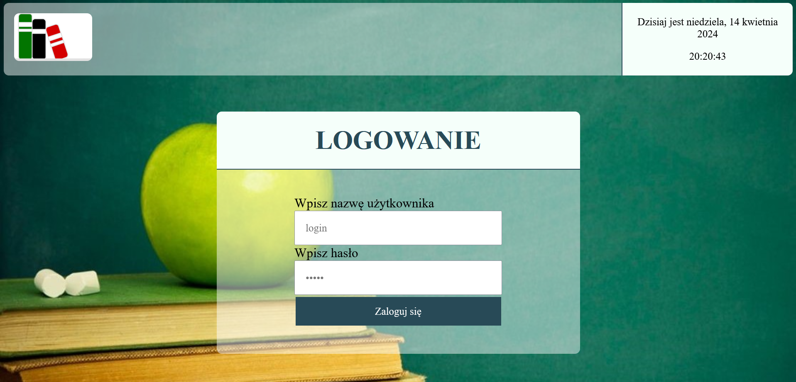
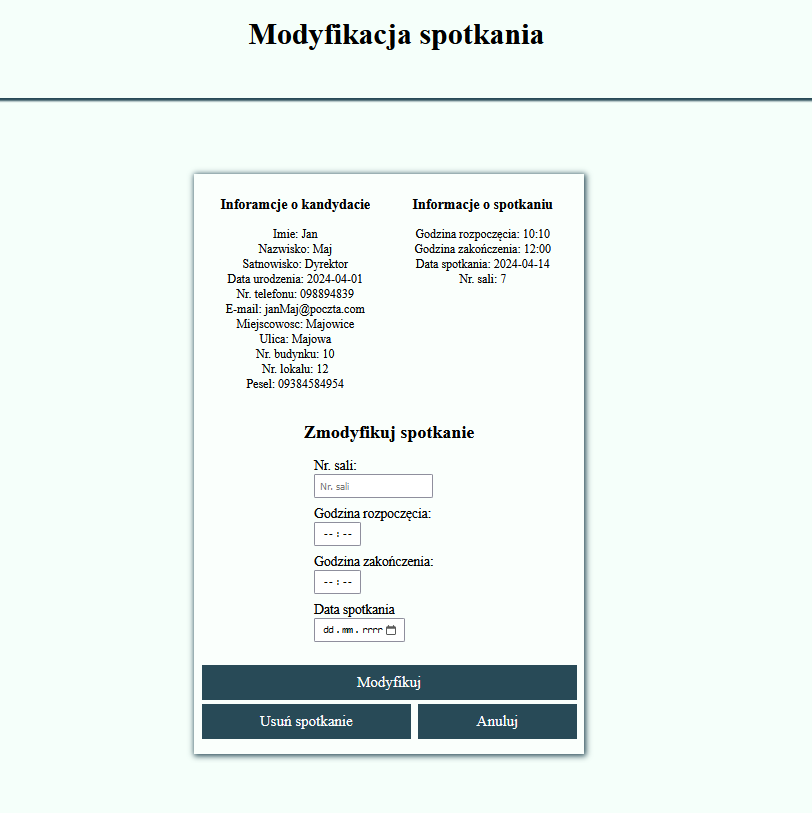
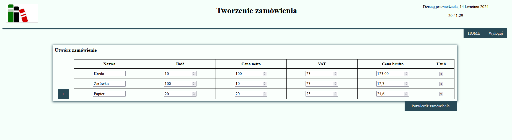

# School Network Management System

Welcome to the School Network Management System! This system, developed using PHP, HTML, CSS, and JavaScript, provides a comprehensive set of features to help manage school operations efficiently.

### Login
- Secure login for authorized users.
- Different user types with varying access rights:
    - Owner: meetings schedule view, add, modify and delete meeting, list of ordered products
    - Secretary: registration of new employees, orders list, new order creation, list of reported products shortage
    - Director: meetings schedule view, add, modify and delete meeting
    - Employee: reporting meeting shortage
    - Purchasing Department: ordered products list, order editing, rejection, acceptation, commenting
    - Delivery Specialist: ordered products list without editing
      
 


### Meetings schedule
- View the schedule of upcoming meetings.
- Navigate through the schedule week by week.
- Modify existing meetings.
- Add new meetings.
  
 


### Adding meeting form
- A form to add new meetings to the schedule.
- Add candidate information: name, surname date of birth, e-mail, address, position and meeting date.
  
 


### Modification of meeting form
- Edit existing meeting details. 
- Modify room number, start time, end time and meeting date. 
- Delete meeting button.

 


### Creating an order
- Create forms to order necessary items for the school.
- Add product name, quantity, net price, taxes and gross price.

 


### Reporting a product shortage
- Report when there is a shortage of a particular product.
- Add shortage product name.

 


### List of reported products
- View a list of all reported product shortages with report date, product name and status.

 


### Run project
First install [Xampp](https://www.apachefriends.org/download.html) on you're machine and copy App from project repository Main branch into htdocs directory.

To run application first you should start MySql and Apache services in Xampp. Next, set up database by running [database query](https://github.com/PPowroznik02/Schools-network/blob/sketches/siecszkolQuery.sql) in phpmyadmin tool.

[Sample](https://github.com/PPowroznik02/Schools-network/blob/sketches/haslaPracownikow.txt) user names and passwords can be found on sketches branch.

Php my admin is available by default on localhost 80
```
http://localhost:80/phpmyadmin/
```

School network management system is available by default on localhost 80
```
http://localhost:80/App/index.php
```
